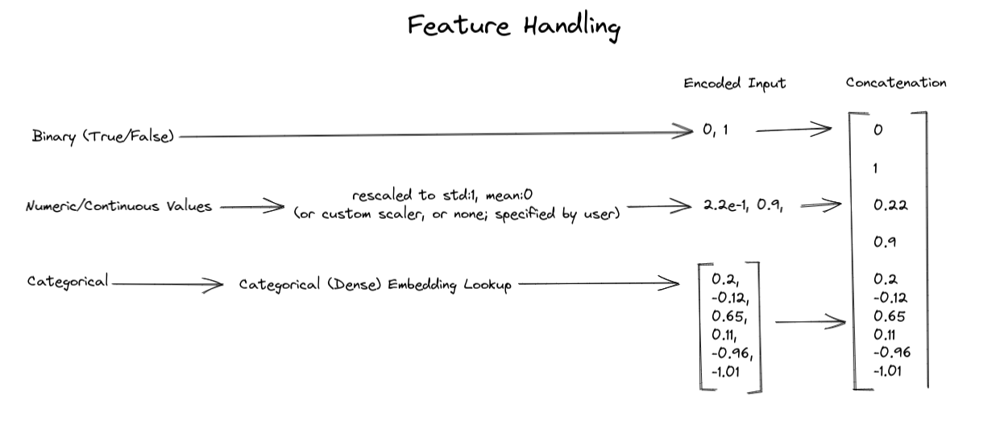

# dfencoder - AutoEncoders for DataFrames

Want to learn useful nonlinear representations of your tabular data? Don't have time to mess with autoencoders? This library aims to simplify your life.<br><br>
Currently under development.<br><br>
# Installation
We highly recommend using a virtual environment to install! This software has only been tested using python 3.6.<br><br>
The bare-bones requirements are installed automatically by pip. You may also want to install jupyter and matplotlib to run notebooks and the ipynb logger, but these are not requirements to install.<br><br>
Install using:<br><br>
```
pip install dfencoder
```
<br><br>
Or, you can get the latest version by cloning this repository and installing from the home directory:
<br><br>
```
pip install .
```
<br><br>
# Usage
Thorough documntation is still being written, but the [demo notebook](demo_data/demo.ipynb) is available to show some of the features of this library.
# Running the tests
The `adult.csv` dataset is used in the testing script. Make sure the file (found in the root of this repo) is in the same directory as `test.py` when you run the script.
# Contributing
Contributors are welcomed! Please reach out with PRs.
# Feature Requests and Bugs
We'd like to release a stable version soon, so in the meantime please submit feature requests and bug reports on this repository's issues page.
## Thanks for your interest in this project!

# Dataframe Encoding
`dfencoder` does some manipulation to encode features to feed into the
feed-forward MLP. This HLD hopefully clears up how this looks.


# Features
This library is a personal project so progress is slow. The latest release as of this writing is `v0.0.38` which fixes an issue handling null records in timestamp columns.

## Previous Releases:
`v0.0.37` which introduces "inference mode"
that optimizes inference for single records, on json inputs. <br><br>

Pre-process your timestamp columns by using pandas: `pd.to_datetime()` so `dfencoder` can infer the datatype and handle it accordingly. 
